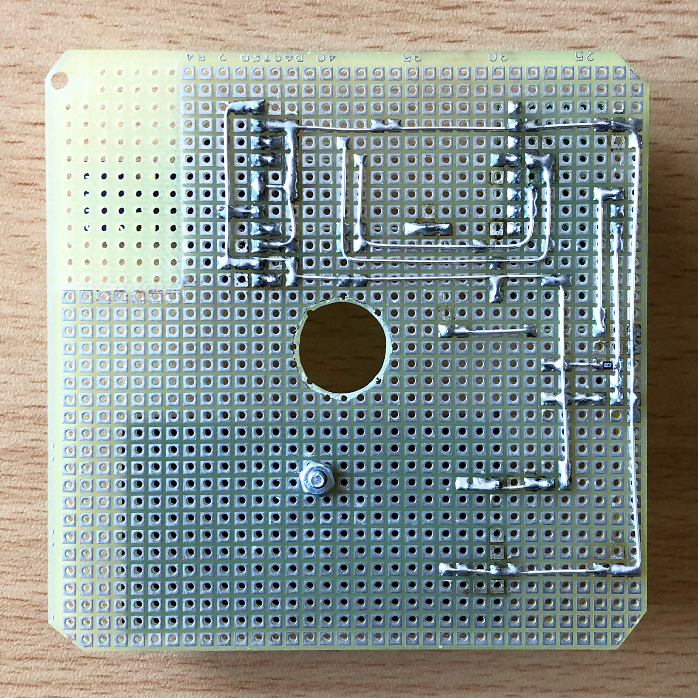
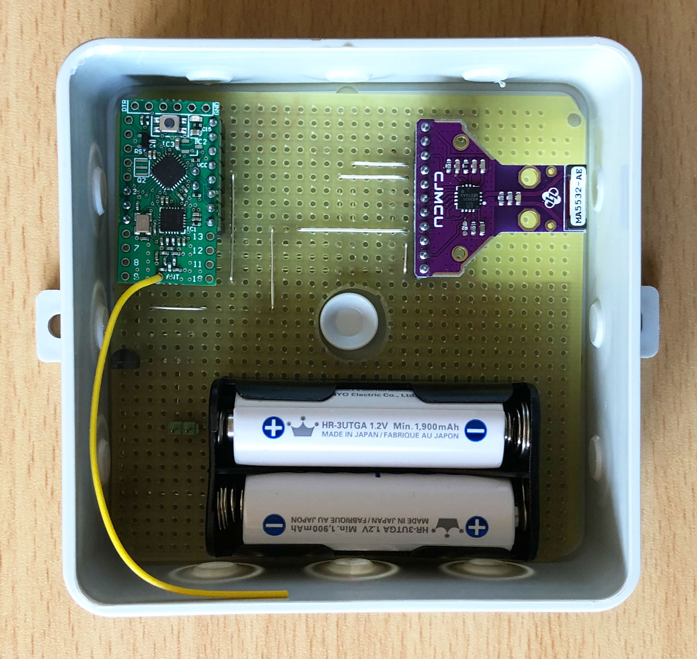
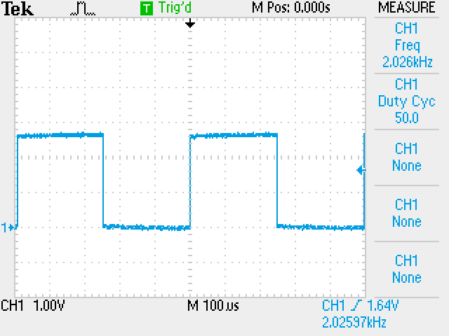
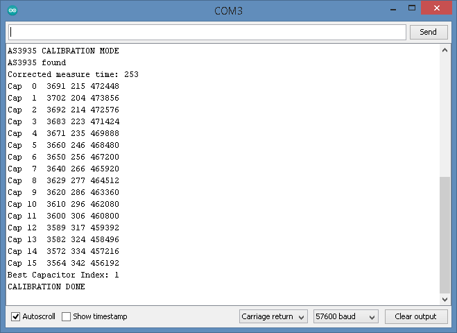
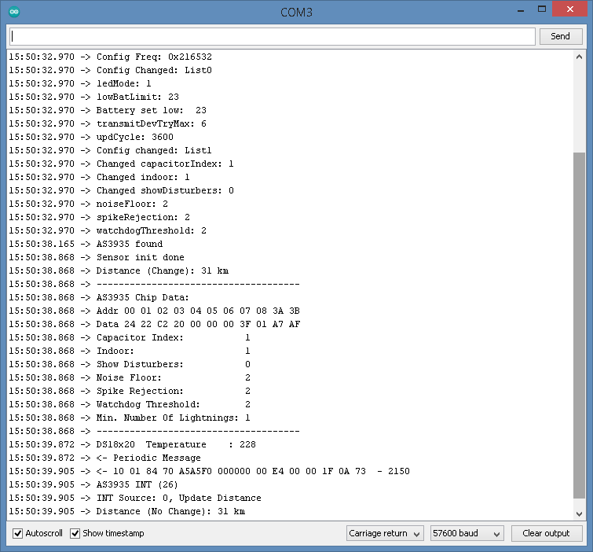

# HB-UNI-Sensor-Blitz

- Der HB-UNI-Sensor-Blitz ist ein Homebrew HomeMatic-Sensor zur Erkennung von Blitzen, basierend auf dem AS3935 Franklin-Blitzsensor IC von ams (Austria Mikro Systeme).
- Der AS3935 ist ein programmierbarer Sensor, der Blitzaktivitäten in einer Entfernung von bis zu 40 km erkennen kann. Er verwendet einen proprietären, fest verdrahteten Algorithmus, um Rauschen und künstlich verursachte Störfaktoren herauszufiltern und die Entfernung zur Gewitterfront abzuschätzen.
- Er verfügt über programmierbare Detektionsebenen, Schwellenwerteinstellungen und Antennenabstimmung, im Gegensatz zu vielen früheren terrestrischen Blitzsensoren kann er sowohl Blitzaktivitäten von Wolke zu Boden als auch innerhalb von Wolken erfassen.
- Alle Parameter des Chips sind über das HomeMatic WebUI konfigurierbar.
- Pro erkanntes Blitz-Ereignis wird eine Nachricht an die Zentrale gesendet. Dabei inkrementiert jedes Ereignis den Datenpunkt 'Blitzzähler' und außerdem wird der Datenpunkt 'Blitz-Entfernung' (Entfernung zur Gewitterfront) entsprechend aktualisiert.
- Zusätzlich habe ich noch einen Temperatursensor mit DS18B20 in das Gerät integriert.

## Hinweise

- Zum Kompilieren des Sketches benötigt man alle Dateien unterhalb der Verzeichnisses *Arduino*. 

- Der HB-UNI-Sensor-Blitz Sketch benötigt den master-Branch der [AskSinPP Library](https://github.com/pa-pa/AskSinPP), nicht den V4 Release-Branch wie dort angegeben. 
  Grund: Verwendung der broadcastEvent() Methode.
  
- Für den Prototyp habe ich Stefans geniales All-in-One Board [Arduino-Pro-Mini-RF](https://github.com/Asselhead/Arduino-Pro-Mini-RF) verwendet, welches ATmega328, CC1101 und weitere notwendige Komponenten auf einem Board integriert. 
  Der Verdrahtungsplan unten zeigt die herkömmliche Verdrahtung mit Arduino Pro Mini und separaten CC1101.

## Bilder

###### AS3935 Sensor

###### HB-UNI-Sensor-Blitz Prototyp

## Schaltung

###### Verdrahtung

###### Interne Schaltung des AS3935 Breakout-Boards

- Die beiden in der Verdrahtung gezeigten 10k Widerstände an SCL und SDA sind nur einmal nötig. Je nach AS3935 Breakout-Board sind diese eventuell bereits dort enthalten.
- Im hier verwendeten Board ist z.B. der 10k Widerstand an SCL vorhanden. Also muss man nur noch den 10k Widerstand an SDA einsetzen.

###### Ruhestrom

Der Ruhestrombedarf des Gerätes liegt bei ca. 72µA. Dies wird hauptsächlich vom Blitzsensor IC selbst verursacht, da dieser die ganze Zeit scannen und evaluieren muss. 
Mit 2 AA Zellen mit 2500mAh würde das in der Theorie eine Laufzeit von ca. 4 Jahren ergeben, in der Realität natürlich viel kürzer wegen den Sendenachrichten an die Zentrale und der Selbstentladung der Batterien. 
Ich glaube das man dennoch mit ca. 2 Jahren Laufzeit rechnen kann, was für diese Art Sensor auch kein schlechter Wert wäre. 

Achtung, um den niedrigen Ruhestrom zu erreichen muss der Widerstand R2 auf dem Breakout-Board entfernt werden!

## Abgleich

Der AS3935 sollte möglichst genau auf seine Empfangsfrequenz von 500kHz abgestimmt werden da der interne Algorithmus zur Erkennung von Blitzen darauf ausgelegt ist.  
Im Sketch sind diese 2 Arduino Pins zur Aktivierung des Modus zur Kalibrierung definiert: 
`#define CALIBRATION_PIN1 A0` 
`#define CALIBRATION_PIN2 A1` 

Diese beiden Pins müssen bei Power-On bzw. Reset wechselweise an Masse gelegt werden um in die 2 Modi zur Kalibrierung zu gelangen.

1. AVR Taktfrequenz: CALIBRATION_PIN1 an Masse
 - Im seriellen Monitor ist "AVR FREQUENCY MEASURE MODE" zu lesen.
 - Die AVR Taktfrequenz wird heruntergeteilt an Pin 6 ausgegeben, bei exakt 8MHz Takt werden exakt 2000Hz ausgegeben.
 - Die Frequenz möglichst genau an Pin 6 messen und in der Datei Sens_AS3935.h, Zeile 39 eintragen, in Hertz, z.B.: 
   `#define CLK_TEST_FREQ_HZ 2026`
 - Dieser Test ist nur bei Verwendung des AVR internen RC-Oszillators als Taktquelle nötig. Bei Nutzung eines 8MHz Quarzes am AVR ist die Taktfrequenz hinreichend genau, in diesem Fall 2000 eintragen: 
   `#define CLK_TEST_FREQ_HZ 2000`
 - :warning: Nach Änderung des Wertes CLK_TEST_FREQ_HZ muss der Sketch neu kompiliert und geflasht werden damit die ausgemessene Frequenz im nächsten Schritt zur Verfügung steht.

2. AS3935 Empfangsfrequenz: CALIBRATION_PIN2 an Masse
 - Im seriellen Monitor ist "AS3935 CALIBRATION MODE" zu lesen.
 - Es werden die Sensor-internen, 16 möglichen Abtimmkapazitäten durchgeschaltet und jeweils die AS3935 Empfangsfrequenz dafür gemessen.
 - Nach Abschluss des Durchlaufs wird der beste Kapazitätsindex im Bereich 0..15 angezeigt (der, der am Nächsten zu 500kHz liegt).
 - Diesen Kapazitätsindex muss nach dem Anlernen des Gerätes in den Geräteeinstellungen für den HB-UNI-Sensor-Blitz eingetragen werden.

## Web-UI / HomeMatic-Zentrale

Der HB-UNI-Sensor-Blitz wird ab Version 2.53 meines [HB-TM-Devices-AddOn](https://github.com/TomMajor/SmartHome/tree/master/HB-TM-Devices-AddOn) voll unterstützt.

###### Gerät mit Datenpunkten

###### Geräteparameter

###### Serieller Log

## Erklärung der Geräteparameter

*Doku in Arbeit*

## Benötige Libraries

[AskSinPP Library](https://github.com/pa-pa/AskSinPP) 
[EnableInterrupt](https://github.com/GreyGnome/EnableInterrupt) 
[Low-Power](https://github.com/rocketscream/Low-Power)

Für einen DS18x20 Sensor (Temperatur): 
[OneWire](https://github.com/PaulStoffregen/OneWire)

## Lizenz

**Creative Commons BY-NC-SA** 
Give Credit, NonCommercial, ShareAlike

 This work is licensed under a <a rel="license" href="http://creativecommons.org/licenses/by-nc-sa/4.0/">Creative Commons Attribution-NonCommercial-ShareAlike 4.0 International License</a>.
