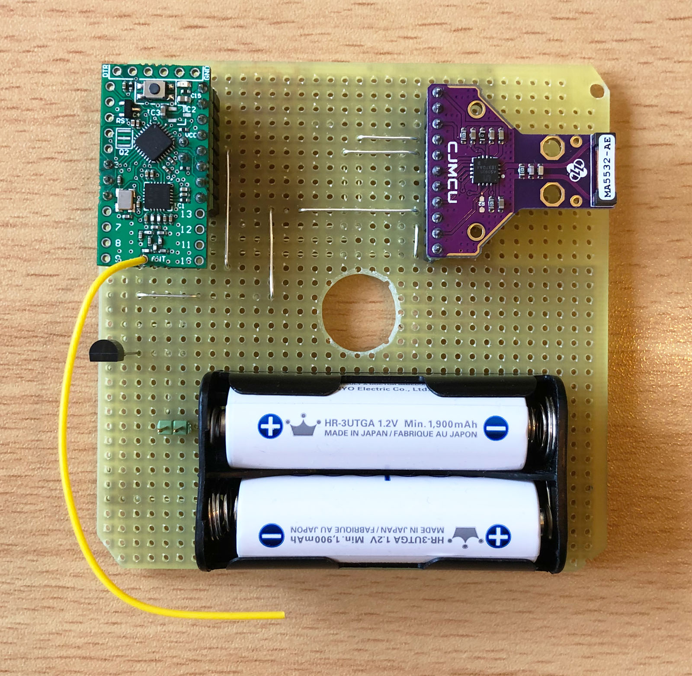
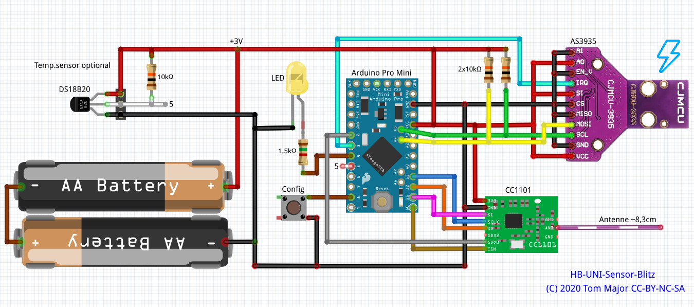
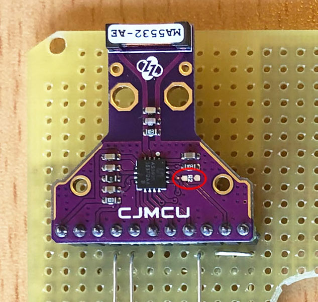

# HB-UNI-Sensor-Blitz

- Der HB-UNI-Sensor-Blitz ist ein Homebrew HomeMatic-Sensor zur Erkennung von Blitzen, basierend auf dem AS3935 Franklin-Blitzsensor IC von ams (Austria Mikro Systeme).
- Der AS3935 ist ein programmierbarer Sensor, der Blitzaktivitäten in einer Entfernung von bis zu 40 km erkennen kann. Er verwendet einen proprietären, fest verdrahteten Algorithmus, um Rauschen und künstlich verursachte Störfaktoren herauszufiltern und die Entfernung zur Gewitterfront abzuschätzen.
- Er verfügt über programmierbare Detektionsebenen, Schwellenwerteinstellungen und Antennenabstimmung, im Gegensatz zu vielen früheren terrestrischen Blitzsensoren kann er sowohl Blitzaktivitäten von Wolke zu Boden als auch innerhalb von Wolken erfassen.
- Alle Parameter des Chips sind über das HomeMatic WebUI konfigurierbar.
- Pro erkanntes Blitz-Ereignis wird eine Nachricht an die Zentrale gesendet. Dabei inkrementiert jedes Ereignis den Datenpunkt 'Blitzzähler' und außerdem wird der Datenpunkt 'Blitz-Entfernung' (Entfernung zur Gewitterfront) entsprechend aktualisiert.
- Zusätzlich habe ich noch einen Temperatursensor mit DS18B20 in das Gerät integriert.

## Hinweise

- Zum Kompilieren des Sketches benötigt man alle Dateien unterhalb der Verzeichnisses *Arduino*. 

- Der HB-UNI-Sensor-Blitz Sketch benötigt den master-Branch der [AskSinPP Library](https://github.com/pa-pa/AskSinPP), nicht den V4 Release-Branch wie dort angegeben. 
  Grund: Verwendung der broadcastEvent() Methode.

## Bilder

###### AS3935 Sensor

###### HB-UNI-Sensor-Blitz Prototyp

## Schaltung

###### Verdrahtung

###### Interne Schaltung des AS3935 Breakout-Boards

###### Ruhestrom

Der Ruhestrombedarf des Gerätes liegt bei ca. 72µA. Dies wird hauptsächlich vom Blitzsensor IC selbst verursacht, da dieser die ganze Zeit scannen und evaluieren muss. 
Mit 2 AA Zellen mit 2500mAh würde das in der Theorie eine Laufzeit von ca. 4 Jahren ergeben, in der Realität natürlich viel kürzer wegen den Sendenachrichten an die Zentrale und der Selbstentladung der Batterien. 
Ich glaube das man dennoch mit ca. 2 Jahren Laufzeit rechnen kann, was für diese Art Sensor auch kein schlechter Wert wäre. 

Achtung, um den niedrigen Ruhestrom zu erreichen muss der Widerstand R2 auf dem Breakout-Board entfernt werden!

## Abgleich

*Doku in Arbeit*

## Web-UI / HomeMatic-Zentrale

Der HB-UNI-Sensor-Blitz wird ab Version 2.53 meines [HB-TM-Devices-AddOn](https://github.com/TomMajor/SmartHome/tree/master/HB-TM-Devices-AddOn) voll unterstützt.

###### Gerät mit Datenpunkten

###### Geräteparameter

###### Serieller Log

## Erklärung der Geräteparameter

*Doku in Arbeit*

## Benötige Libraries

[AskSinPP Library](https://github.com/pa-pa/AskSinPP) 
[EnableInterrupt](https://github.com/GreyGnome/EnableInterrupt) 
[Low-Power](https://github.com/rocketscream/Low-Power)

Für einen DS18x20 Sensor (Temperatur): 
[OneWire](https://github.com/PaulStoffregen/OneWire)

## Lizenz

**Creative Commons BY-NC-SA** 
Give Credit, NonCommercial, ShareAlike

 This work is licensed under a <a rel="license" href="http://creativecommons.org/licenses/by-nc-sa/4.0/">Creative Commons Attribution-NonCommercial-ShareAlike 4.0 International License</a>.
